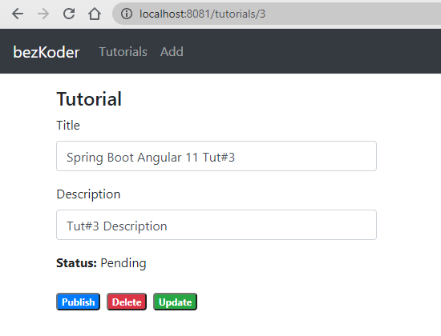
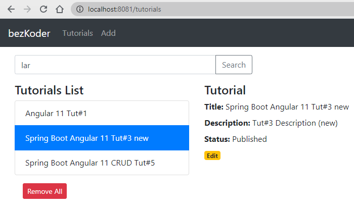

# Spring Boot + Angular 11 CRUD example with MySQL Database

This folder contains a demo application -  SpringBootAngularDemo. It has:
* SpringBoot Java files (spring-boot-server)
* Angular project files (angular-11-client)

## Prerequisites:

* NodeJS/NPM
* Angular-CLI
* Maven
* Visual Studio Code
* Eclipse/IntelliJ IDE

The back-end server uses Spring Boot with Spring Web MVC for REST Controller and Spring Data JPA for interacting with MySQL database.
Front-end side is made with Angular 11, HTTPClient & Router.

We will build a full-stack Tutorial Application in that:

- Each Tutorial has id, title, description, published status.
- We can create, retrieve, update, delete Tutorials.
- We can also find Tutorials by title.
- The images below shows screenshots of our System.

Add an object:

Retrieve all objects:

Click on **Edit** button to go to a Tutorial page:

On this Page, you can:

- change status to *Published* using **Publish** button
- delete the Tutorial using **Delete** button
- update the Tutorial details with **Update** button

Search Tutorials by title:

## Angular 11 & Spring Boot CRUD Architecture
This is the application architecture we will build:

- Spring Boot exports REST Apis using Spring Web MVC & interacts with MySQL Database using Spring Data JPA.
- Angular Client sends HTTP Requests and retrieve HTTP Responses using axios, shows data on the components. We also use Angular Router for navigating to pages.

### To setup Spring Boot project:

* Open Eclipse IDE and import the **spring-boot-server** folder
* Wait for the project to finish building. Once it is complete, you can browse the files.
* (Optional)Install the Spring Tools Eclipse plugin
    * Click on Help -> Install New Software...
    * Paste the following: https://download.springsource.com/release/TOOLS/sts4/update/e4.18
    * Note: The last part of the URL is the Eclipse version. Replace that to match your Eclipse version number.
    * Click Next and accept license agreement.
    * Once the installation is complete, restart Eclipse.
* Check the **application.properties** folder and ensure that the MySQL credentials match your server credentials.
* Once all of the above are complete, we are ready to start the server.
* To start the server,
    * If you have the plugin, right click the project and select Run As -> Spring Boot App
    * If you have Maven installed on your system, in the terminal, run `mvn spring-boot:run`
    * If you none of the above, right click the project, click on Maven -> Maven Build... -> In the Goals field, enter `spring-boot:run`

### To setup Angular project:

* Open Visual Studio Code and import the **angular-11-client** folder.
* You may browser the file once the import is complete.
* Open a terminal window in VSCode.
* cd into the **angular-11-client** folder and run `npm install`
* Once the application's module files are generated, run the `ng serve -o` to start the Angular application
* A browser tab/window will open up with the application's homepage.

Congratulations!! Your Angular-Spring Boot application is now ready for use!
